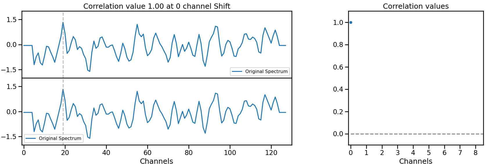
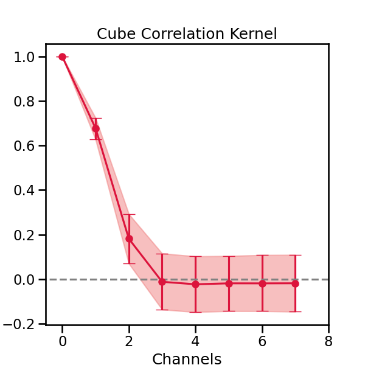

# LSFExtractor

## Description

This module enables users to extract the Line Spread Function (LSF) from any type of spectral cube. The provided code automatically handles multiple axes in the datacube. 

Currently, the code estimates the LSF only for ALMA data cubes, but we are actively developing support for additional types of cubes.


## Getting Started
Releases are registered on [PyPI](https://pypi.org/project/LSFExtractor/), and development is occurring at the project's [GitHub page](https://github.com/nsotostuardo/LSFExtractor).


### Installing

To install astropy from PyPI, use:

`pip install LSFExtractor`


### Executing program


First we need to import the module to the python script or notebook.

```
import LSFExtractor as lsf
```

The module executes by creating an instance of the class with just the path to a cube file, and then using the `get_LSF` method.

```
cube = lsf.Cube('path_to_file')
cube.get_LSF()
```

The method returns a list of length three corresponding to LSF, LSF lower error, and LSF upper error, respectively. It can also be accessed using the `.LSF` attribute of the class

```
 LSF, LSF_lower, LSF_upper = cube.LSF
````

The class includes the method `.save_LSF(path, format = '.3f', write = True)` which creates an Astropy QTable with the code's output and saves it as an ASCII table in the file named `path_LSF.dat`


```
cube.save_LSF('new_path')
```

More documentation can be found inside the .py files.

## Correlation Kernel Methodology 

To explain how the correlation kernel is obtained across a datacube, it’s better to start with a single spaxel.

Calculating the correlation of the spectrum with itself results in a value of 1. To retrieve the correlation between nearby channels, the same spectrum is shifted by one channel at a time over a few channels, as shown below.

 </img>

Keeping the length of each spectrum consistent, the correlations are computed using the Pearson product-moment correlation from NumPy.

For each spaxel, the same method is used, resulting in correlation kernel distribution from which the 16th, 50th, and 84th percentiles are used for the LSF estimation and its errors.

<div align="center">

<div align="left">

## Authors


* [jigonzal](https://github.com/jigonzal)
* [nsotostuardo](https://github.com/nsotostuardo)

## Version History

* 0.1
    * Beta Release


## Acknowledgments

* [LSF](https://github.com/jigonzal/LSF)
* [The Astropy Project](https://github.com/astropy)
* [awesome-readme](https://github.com/matiassingers/awesome-readme)